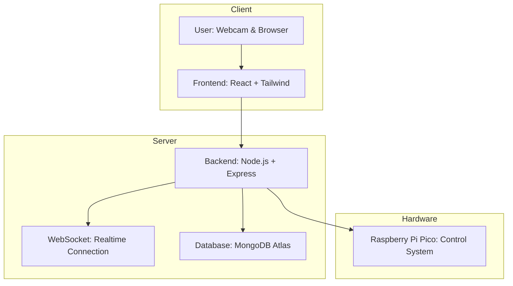

# Lipstick-maker: An Automated Lipstick Manufacturing Platform with AI-Driven Skin Tone Analysis and Color Matching

> **Automated lipstick production with AI-based skin tone analysis and Raspberry Pi Pico-controlled color blending.**

---

## 🧠 Overview

**Lipstick Maker** is an intelligent, end-to-end system that merges **Artificial Intelligence**, **Web Technology**, and **Hardware Automation** to revolutionize the way people find their perfect lipstick shade.

By analyzing a user’s **facial undertone** (Winter, Summer, Spring, Autumn), the platform recommends personalized lipstick colors.  
Once selected, the system **automatically mixes the shade** using **a pneumatic + conveyor-belt mechanism** powered by **Raspberry Pi Pico**.

This project minimizes cosmetic waste, enhances personalization, and demonstrates how technology can redefine sustainability in beauty manufacturing.

---

## 🪄 Key Features

- 🎨 **AI Skin Tone Analysis** — Powered by TensorFlow.js and MediaPipe FaceMesh  
- 🧑‍💻 **Interactive Web Interface** — Built with React.js and Tailwind CSS  
- ⚙️ **Real-Time Control System** — Node.js + WebSocket + Raspberry Pi Pico integration  
- 💽 **MongoDB Atlas** — Centralized recipe & color database  
- 🧩 **Automated Dispensing** — Stepper motor conveyor & pneumatic color syringes  
- 🌿 **Eco-Friendly Design** — Produces *sample-size* lipstick to reduce waste  

---

## 🏗️ System Architecture

---

## 🧩 System Components

### 🧠 AI & Analytics

| Feature | Description |
|----------|--------------|
| **Face Detection** | TensorFlow.js + MediaPipe FaceMesh detects facial regions (forehead, left cheek, right cheek). |
| **Undertone Analysis** | Calculates hue angles to classify undertones (Warm > 60°, Cool < 60°, Neutral = 60°). |
| **Lightness Classification** | Based on L values → High, Medium, Low. |
| **Seasonal Mapping** | Combines undertone + lightness to map to seasonal palettes (e.g., Warm + High = Spring). |
| **Color Recommendation** | Suggests 3 lipstick shades for user to try-on. |

### Frontend
- **React.js + Tailwind CSS** UI for capturing webcam input, skin tone detection, and shade selection.  
- Responsive and theme-consistent interface with real-time video analysis.

### Backend
- **Node.js + Express** handles REST APIs, WebSocket communication, and serial I/O (UART 115200 baud).  
- Data stored in **MongoDB Atlas** with Mongoose schemas for lipstick recipes and user analysis.  
---

### ⚙️ Hardware Setup

| Component | Function |
|------------|-----------|
| **Raspberry Pi Pico** | Central control unit for motor and pneumatic systems |
| **Stepper Motor (24V)** | Moves conveyor belt precisely (200 steps/rev) |
| **Solenoid Valve (Airtac 4V210-08)** | Controls airflow for syringe actuation |
| **Air Regulator (SMC ITV2030-312L)** | Maintains stable pneumatic pressure |
| **Pneumatic Syringe (10 cc)** | Dispenses lipstick base and pigments |
| **Air Compressor (JUN AIR-6-X)** | Supplies compressed air |
| **Relay Module (4-Channel)** | Switches high-power solenoid valves |
| **ET-MINI I2C DAC** | Converts digital control signals to analog voltage (3000 mV) |

---

## ⚗️ Operation Flow

1. User opens web interface and clicks **Start**.  
2. System analyzes skin tone → classifies undertone + recommends 3 lipstick shades.  
3. User selects a shade → backend sends color ratios to Raspberry Pi Pico.  
4. Conveyor moves the cup sequentially to 3 dispensing stations.  
5. Syringes dispense base colors via pneumatic control for timed durations.  
6. Final sample lipstick is mixed and ready for testing.  

---

## 📊 Results & Evaluation

- **Average analysis time:** 230 ms  
- **User satisfaction:** 4 / 5 average rating  
- **Highest-rated palettes:** Winter & Autumn  
- **Outcome:** Reduced waste through sample-sized lipstick creation  

Users appreciated personalization accuracy and eco-friendly production, with repeat usage observed among testers.

---

## 🧩 Future Improvements

- Expand color database for diverse skin tones  
- Enhance mixing precision and hardware durability  
- Integrate mobile app for broader accessibility  
- Improve feedback loop with shade refinement  

---

## 🧑‍🏫 Acknowledgment

We sincerely thank:

- **Assoc. Prof. Dr. Ratchatin Chancharoen**  
- **Dr. Gridsada Phanomchoeng**  
- **Mr. Kantawatchr Chaiprabha**  
- **Mr. Chaiwuth Sithiwichankit**

for their invaluable mentorship and support during this project.

---

## 🎥 Demo Video

📹 [Watch the demo on Google Drive](https://drive.google.com/file/d/1_yywNhzuh9i70DStk7ZZxU2BK51Vln_P/view?usp=sharing)

---

## 📚 References

1. Basurah, M. et al. *Implementation of Face Recognition and Liveness Detection System Using TensorFlow.js*, Jurnal Informatika Polinema, 2023.  
2. Bell, C. *Beginning MicroPython with the Raspberry Pi Pico*.  
3. Cubas, A.L.V. et al. *The Beauty Industry and Solid Waste*, 2020.  
4. Kim, B. et al. *Method and analysis of color changes of facial skin after applying skin makeup*, Vision Research, 2023.  
5. Lazuardy, M.F.S. & Anggraini, D. *Modern front-end web architectures with React.js and Next.js*, 2022.  
6. Mondello, A. et al. *Exploring Circular Economy in the Cosmetic Industry*, 2024.  
7. Park, H. et al. *AI-Based Classification of Personal Color*, IEEE ICNC-FSKD 2023.  
8. Sirisayan, P. *Personal Color Analysis Based on Color Harmony for Skin Tone*, 2022.  
9. Tilkov, S. & Vinoski, S. *Node.js: High-Performance Network Programs*, IEEE Internet Computing, 2010.

---

### 🧑‍🔬 Authors

| Name | Student ID | Affiliation |
|------|-------------|--------------|
| Supaphan Sittithanon | 6538216321 | Robotics & AI, Chulalongkorn University |
| Kirana Trakulmaykee | 6538016121 | Robotics & AI, Chulalongkorn University |
| Chalinee Chanprasert | 6538037321 | Robotics & AI, Chulalongkorn University |
| Buddharaksa Phatcharasaksakol | 6538135121 | Robotics & AI, Chulalongkorn University |

---

## 🪄 License
© 2025 Lipstick Maker Team.  
All rights reserved. For educational and research purposes only.
